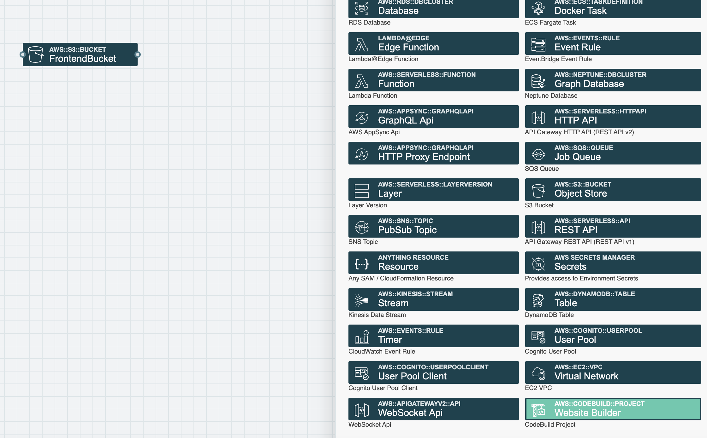
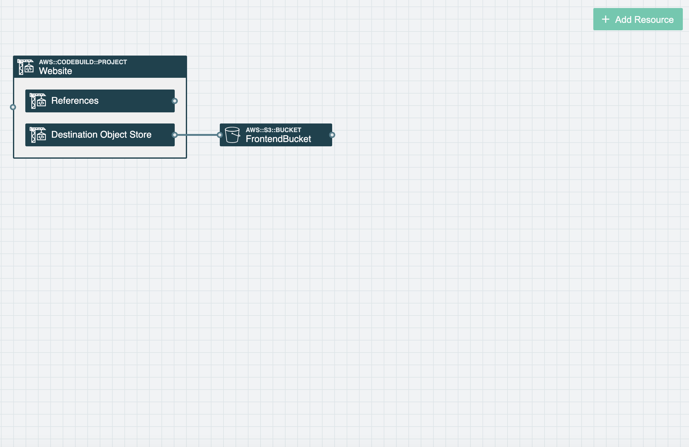
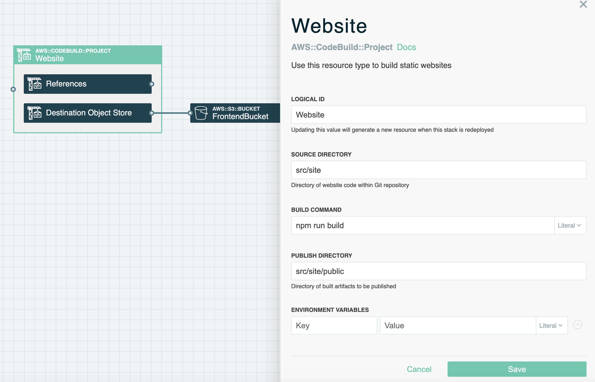
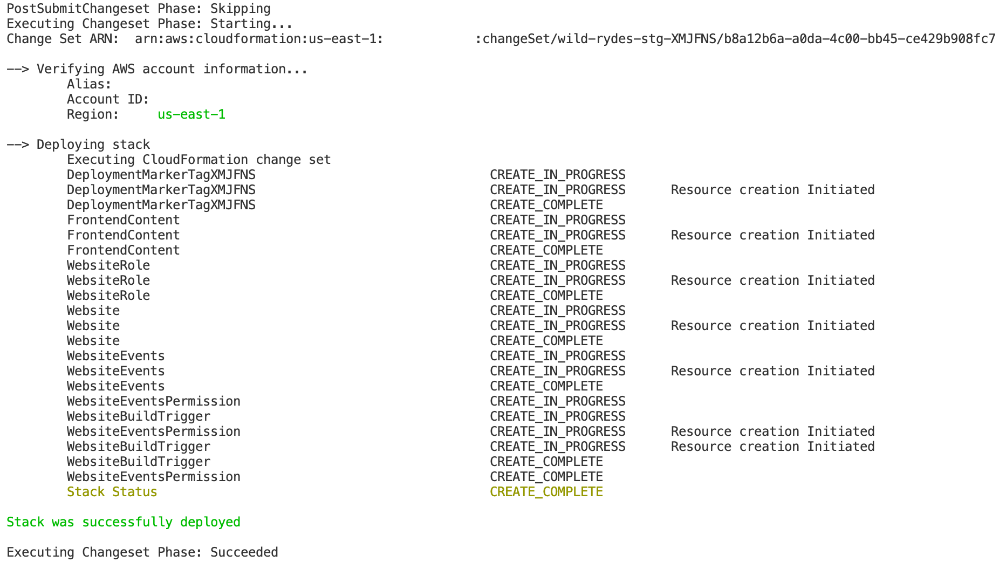
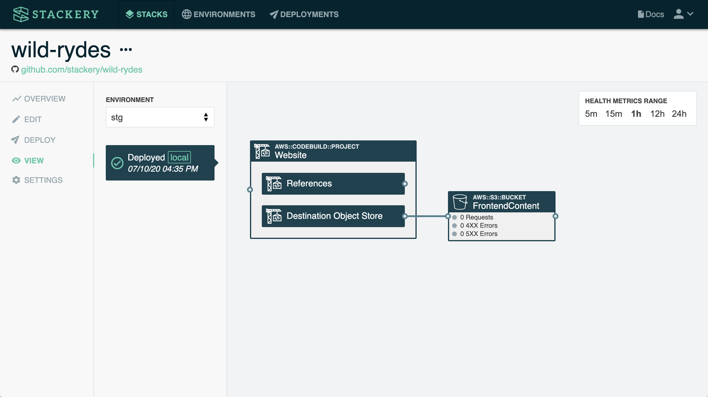

# Frontend Content
In this step of the workshop you will create and deploy the *Wild Rydes* frontend. The frontend is composed of an AWS S3 bucket and an AWS Lambda function that is triggered on deployment which will populate the S3 bucket with the *Wild Rydes* static content.

## AWS Services

* [AWS S3](https://docs.stackery.io/docs/api/nodes/ObjectStore/)
* [AWS Lambda](https://docs.stackery.io/docs/api/nodes/Function/)
* [AWS CodeBuild for deploying static website content](https://docs.stackery.io/docs/api/nodes/Website/)
* [AWS Cloudformation](https://docs.aws.amazon.com/cloudformation/index.html)

## Instructions

> (Optional) If you use the VS Code IDE, parts of steps 1-4 can be completed in VS Code using the Stackery extension. Read the [VS Code setup instructions](vscode-setup-instructions.md) if you would prefer to work in the IDE rather than the browser. You will still need a Stackery account, as you need to log into Stackery when using the extension.

### 1. Add an Object Store resource
Add an *Object Store* resource (an AWS S3 Bucket) to serve the website content. With `stackery edit` running in the terminal, click the **Add Resource** button in the top right of the screen to reveal the resources menu. Then click on the *Object Store* resource to add it to the canvas and your application stack. Alternatively you can also drag and place the resource on the canvas.


Next, double-click on the Object Store resource on the canvas to edit its settings. Set the **CLOUDFORMATION LOGICAL ID** field to `FrontendContent`. Then click **ENABLE WEBSITE HOSTING** and leave the value of **INDEX DOCUMENT** as `index.html`. Be sure to click the button to save the Settings.


### 2. Add a Website resource
Add a Website resource (an AWS CodeBuild Project) to build the website's static content. This function will copy the contents of a directory in the project source code to the Object Store we've just configured.

From the *Add Resources* menu (found buy clicking *Add Resource*), click a Website resource to add it to the stack.



Next drag a wire from the Website resource's Destination Object Store to the *FrontendContent* Object Store. **Make sure to drag the wire to the connector on the left side of the Object Store resource**.



Double-click on the Website resource to view its settings. The default settings work well for our use case, where it will run `npm run build` in the `src/site` directory, then upload all the files from `src/site/public` to the destination object store.



Your stack should now look like this:


### 3. Edit website code locally

You will now locally edit the website source code. To simplify this task we will grab the source code from this workshop repository.

First, `git clone` this workshop to your computer. You will be copying code from the workshop repository into your own application stack. Open a new terminal tab or window in the same directory, then enter the following:

```
cd ..
git clone https://github.com/stackery/wild-rydes-workshop.git wild-rydes-workshop
```

We will copy the following files and directories from the workshop to your application stack's directory using the commands below.

* Static assets: [src/site/public](./src/site/public)
* Build dependencies: [src/site/package.json](./src/site/package.json)
* Build script: [src/site/build.js](./src/site/build.js)

You can do this by running the following command on Linux or MacOS.

```bash
cp -R wild-rydes-workshop/src/site stackery-wild-rydes/src
```


### 4. Deploy the stack
You'll now deploy the *stackery-wild-rydes* stack to AWS. Stackery will package your code repository and deploy it using AWS CloudFormation.

We'll be using the `stackery deploy` command with the `interactive-setup` flag. This allows us to add our new stack to Stackery, create a new environment to deploy into, and even link our AWS account if needed. In the terminal, enter:

```bash
cd stackery-wild-rydes
stackery deploy --interactive-setup
```

Follow the prompts to continue: hit enter to keep the stack name *stackery-wild-rydes*, then select your AWS profile (if you only have one, it'll likely be called `default` and may be selected automatically). When asked if you would like to create a new environment, hit `y` and enter an environment name - we suggest `development`. It's normal to have multiple environments when building serverless apps, such as development, staging, and production.

Once your stack and environment have been created, the deployment process begins. This typically takes a few minutes. When finished, your readout should look something like this:




### 5. View the website

Now you can visit your Wild Rydes website that you have deployed.

Once the deployment is complete, open the Stackery App in your browser, and navigate to the __Stacks__ view tab:


Click on the *stackery-wild-rydes* stack. You will be taken to the __Overview__ tab. From there, click on the __View__ link, and you'll see your stack's deployed view:



Double-click the *FrontendContent* Object Store resource to view its details. On the details slide-in click on the **Website Hosting Address** link to open the website.


The website should appear, though it's missing resources it needs to be fully functional.


## Next Steps

Proceed to the next module in this workshop:

* [User Management](./02-user-management.md)

